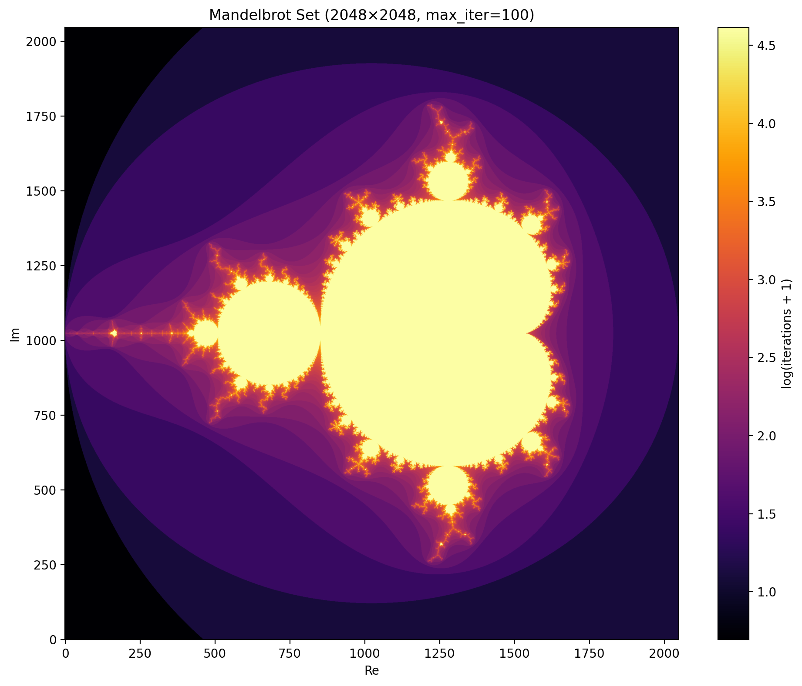
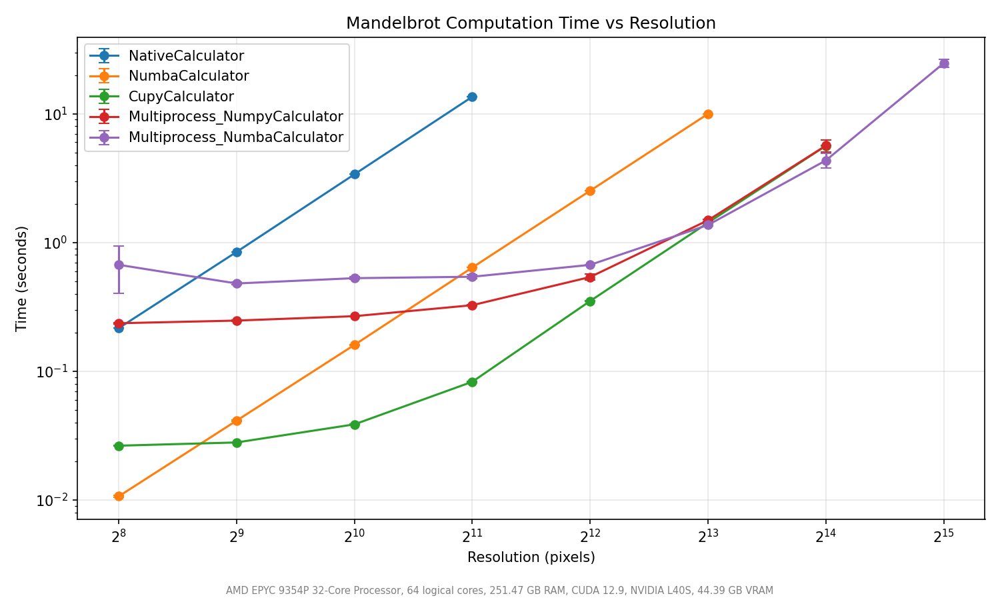
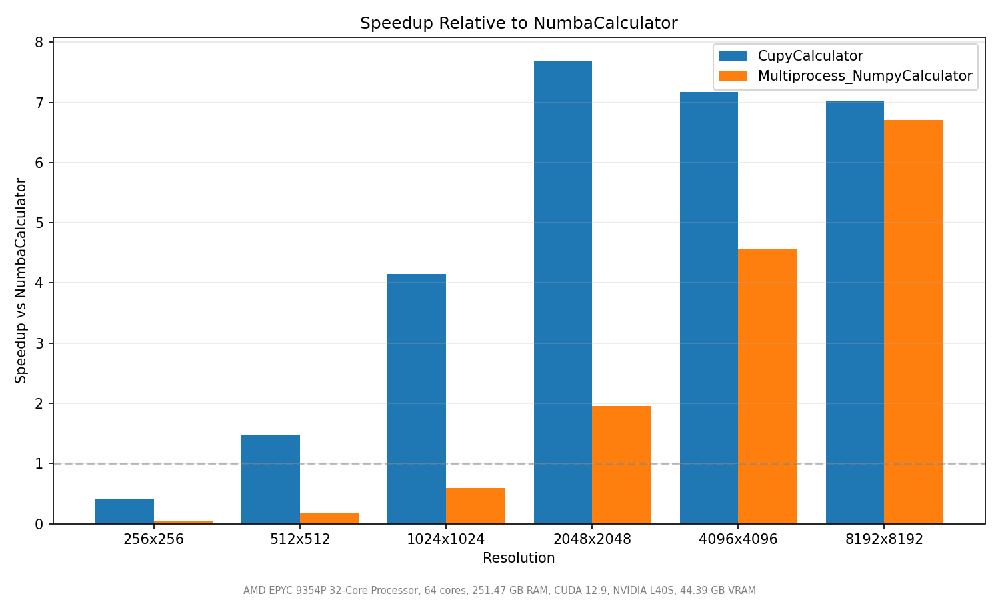

# Miniproject 3 — Mandelbrot Set Benchmark
( this is not the school report - this is just a docs for the code )
<table>
<tr>
<td width="65%">

## Project Structure

```
miniproject3/
├── src/                      # Calculator implementations
│   ├── config.py             # MandelbrotConfig dataclass
│   ├── mb_calculator.py      # Abstract base class
│   ├── mb_native_calculator.py   # Pure Python
│   ├── mb_numpy_calculator.py    # Vectorized NumPy
│   ├── mb_numba_calculator.py    # Numba JIT
│   ├── mb_dask_calculator.py     # Dask map_blocks
│   ├── mb_multiprocess_calculator.py  # Multiprocessing
│   ├── mb_cupy_calculator.py     # CuPy (CUDA)
│   └── mb_cuda_calculator.py     # @cuda.jit
├── benchmark_app/            # Benchmark application
│   ├── main.py               # Entry point
│   ├── benchmark_config.py   # Config + registry
│   ├── benchmark_runner.py   # Runner + CSV export
│   ├── device_scanner.py     # Hardware detection
│   └── plot_maker.py         # Plot generation
├── test/                     # Tests (pytest)
│   ├── calculator_test.py    # Contract tests for all calculators
│   ├── test_helpers.py       # Unit tests for internals
│   ├── test_benchmark_runner.py  # Runner tests
│   └── test_device_scanner.py    # Device scanner tests
├── results/                  # Output (plots + CSV)
└── README.md
```

</td>
<td width="35%">


</td>
</tr>
</table>

## Implementations

Each calculator inherits from `MandelbrotCalculator` and implements `calculate() -> np.ndarray`.

### Calculator Interface (Abstract Base Class)

```python
from abc import ABC, abstractmethod
import numpy as np
from .config import MandelbrotConfig

class MandelbrotCalculator(ABC):
    """Base class for all Mandelbrot set calculators."""

    def __init__(self, config: MandelbrotConfig):
        self.config = config

    @abstractmethod
    def calculate(self) -> np.ndarray:
        """Compute the Mandelbrot set.

        Returns
        -------
        np.ndarray
            2D integer array of shape (height, width) where each element
            is the iteration count at which the point escaped.
        """
        ...
```

A concrete implementation only needs to subclass and implement `calculate()`:

```python
class NumbaCalculator(MandelbrotCalculator):
    def calculate(self) -> np.ndarray:
        cfg = self.config
        return _numba_compute(cfg.xmin, cfg.xmax, cfg.ymin, cfg.ymax,
                              cfg.width, cfg.height, cfg.max_iter)
```

**Why this design works well:**

- **Polymorphism** — the benchmark runner and tests operate on `MandelbrotCalculator` without knowing which implementation they're running. Adding a new calculator requires zero changes to the benchmark infrastructure.
- **Uniform contract** — every calculator accepts the same `MandelbrotConfig` and returns the same `np.ndarray` shape/dtype, making results directly comparable.
- **Testability** — the parametrized test fixture iterates over all registered calculators and applies the same contract tests to each, catching regressions automatically.
- **Registry pattern** — `benchmark_config.py` maps string names to classes, so the benchmark configuration is just a list of strings (`["numba", "cuda", "cupy"]`) without importing specific classes.

| Calculator | Description |
|---|---|
| `NativeCalculator` | Pure Python double loop. Slowest but simplest baseline. |
| `NumpyCalculator` | Vectorized with NumPy masks. No extra dependencies. |
| `NumbaCalculator` | JIT-compiled with `@jit(nopython=True)`. Near-C speed after warmup. |
| `DaskCalculator` | Dask array `map_blocks` — splits the complex plane into chunks and computes each via Dask's scheduler. Uses the same NumPy kernel per chunk. |
| `MultiprocessCalculator` | Splits image into chunks, processes in parallel with `multiprocessing.Pool`. Configurable base calculator (`native`, `numpy`, `numba`). |
| `CupyCalculator` | GPU-accelerated using CuPy — same vectorized algorithm as NumPy but executes on the CUDA device. |
| `CudaCalculator` | GPU-accelerated using Numba `@cuda.jit` — explicit CUDA kernel with configurable block size. |

### Docstrings

All major functions include NumPy-style docstrings describing purpose, parameters, and return values.
Key examples:
- `_generate_chunks(cfg)` — splits full image into tiles based on `chunk_size`
- `_process_chunk(args)` — computes a single chunk using the selected base calculator
- `_mandelbrot_chunk(c_chunk, max_iter)` — NumPy kernel used by Dask `map_blocks`
- `CupyCalculator.calculate()` — vectorized GPU computation via CuPy arrays
- `_numba_compute(...)` — JIT-compiled kernel for the Numba path

## CUDA / GPU Implementation

The GPU implementation uses **CuPy** (`cupy-cuda12x`), which provides a NumPy-compatible API that executes on the GPU via CUDA.

### Block Size / Warp-Size Analysis

CuPy manages kernel launch parameters internally. The vectorized approach processes the entire grid as a GPU array operation — CuPy automatically selects block dimensions that are multiples of the warp size (32 threads). This is optimal because:
- Threads within a warp execute in lockstep (SIMT); non-warp-multiple block sizes waste execution slots
- CuPy's default heuristics (typically 128 or 256 threads/block) satisfy the warp-size-multiple rule without manual tuning
- For the iterative Mandelbrot workload, thread divergence (pixels escaping at different iterations) is the primary bottleneck, not block size selection

### Why CuPy over `@cuda.jit`

CuPy was chosen over Numba's `@cuda.jit` because:
1. Drop-in replacement for NumPy — minimal code changes
2. Automatic memory management and kernel configuration
3. Better suited for array-level parallelism (the Mandelbrot iteration loop is naturally expressed as masked array ops)

### Numba `@cuda.jit` Implementation

The `CudaCalculator` provides a lower-level GPU implementation using Numba's `@cuda.jit` decorator. Each thread computes exactly one pixel — the thread maps its 2D global index to a complex plane coordinate and iterates the Mandelbrot recurrence.

#### Block Size & Warp-Size-Multiple Rule

NVIDIA GPUs execute threads in **warps** of 32 threads. The block size (threads per block) directly affects occupancy and performance:

| Block Size | Threads/Block | Full Warps | Wasted Slots | Notes |
|---|---|---|---|---|
| 8×8 | 64 | 2 | 0 | Low occupancy — few threads per SM |
| 16×16 | 256 | 8 | 0 | **Optimal** — high occupancy, good 2D mapping |
| 32×8 | 256 | 8 | 0 | Good — maximizes coalesced memory access in x |
| 32×16 | 512 | 16 | 0 | Good — higher occupancy if register pressure allows |
| 32×32 | 1024 | 32 | 0 | Max threads/block — may reduce occupancy due to register pressure |
| 20×20 | 400 | 12.5 | 16 | **Bad** — not a warp multiple, wastes execution slots |
| 24×24 | 576 | 18 | 0 | Valid but non-power-of-2 dims can cause bank conflicts |

**The warp-size-multiple rule:** Block sizes should be multiples of 32 threads because:
1. Threads within a warp execute in lockstep (SIMT model) — partial warps waste GPU execution resources
2. Memory coalescing is most efficient when consecutive threads in a warp access consecutive memory
3. Warp-level primitives (ballot, shuffle) require full warps to function correctly

**Default choice: 16×16 (256 threads/block)** — this is optimal because:
- 256 = 8 × 32 (exactly 8 full warps, zero waste)
- 2D block shape maps naturally to the 2D image grid
- 256 threads is small enough that multiple blocks can reside on an SM simultaneously, maximizing occupancy
- The Mandelbrot kernel uses few registers (~20) so register pressure is not a limiting factor

The `block_size` parameter is configurable to enable benchmarking different sizes.

## Performance Analysis

### Benchmark Configuration

```python
calculators = ["numpy", "numba", "cupy", "cuda",
               "multiprocess_numpy", "multiprocess_numba"]
resolutions = [256, 512, 1024, 2048, 4096, 8192, 16384, 32768, 65536]
max_iter = 100, chunk_size = 256
num_runs = 3, warmup_runs = 1
num_processes = 62 (64 logical cores − 2 reserved for OS)
block_size = (16, 16)  # CUDA JIT kernel
```

### Results

#### Execution Times (seconds, mean ± std)

| Resolution | NumPy | Numba | CuPy | CUDA (@cuda.jit) | MP+NumPy (62p) | MP+Numba (62p) |
|---|---|---|---|---|---|---|
| 256×256 | 0.020 ± 0.000 | 0.011 ± 0.000 | 0.027 ± 0.000 | **0.000** ± 0.000 | 0.248 ± 0.001 | 0.875 ± 0.013 |
| 512×512 | 0.079 ± 0.001 | 0.041 ± 0.000 | 0.028 ± 0.000 | **0.001** ± 0.001 | 0.256 ± 0.003 | 0.342 ± 0.005 |
| 1024×1024 | 0.301 ± 0.002 | 0.158 ± 0.000 | 0.039 ± 0.000 | **0.003** ± 0.002 | 0.277 ± 0.007 | 0.385 ± 0.006 |
| 2048×2048 | 1.393 ± 0.001 | 0.638 ± 0.003 | 0.082 ± 0.000 | **0.003** ± 0.000 | 0.343 ± 0.009 | 0.416 ± 0.002 |
| 4096×4096 | 6.957 ± 0.012 | 2.540 ± 0.008 | 0.351 ± 0.004 | **0.014** ± 0.001 | 0.561 ± 0.011 | 0.560 ± 0.007 |
| 8192×8192 | — | 9.997 ± 0.017 | 1.425 ± 0.006 | **0.055** ± 0.005 | 1.479 ± 0.007 | 1.309 ± 0.110 |
| 16384×16384 | — | — | 5.714 ± 0.096 | **0.199** ± 0.001 | 5.187 ± 0.262 | 4.693 ± 0.645 |
| 32768×32768 | — | — | — | **0.798** ± 0.007 | 24.335 ± 0.331 | 20.515 ± 0.101 |
| 65536×65536 | — | — | — | **3.280** ± 0.175 | — | — |

*"—" = skipped due to exceeding the 5.5s breakout threshold at the previous resolution.*

#### Speedup vs Numba

| Resolution | CUDA | CuPy | MP+NumPy | MP+Numba |
|---|---|---|---|---|
| 256×256 | 49.8× | 0.4× | 0.04× | 0.01× |
| 1024×1024 | 52.9× | 4.1× | 0.6× | 0.4× |
| 4096×4096 | **181.4×** | 7.2× | 4.5× | 4.5× |
| 8192×8192 | **181.5×** | 7.0× | 6.8× | 7.6× |

#### Plots

The benchmark generates three plots saved to `results/`:

- **Time vs Resolution** (`results/time_vs_resolution.png`) — log-scale line plot showing how each implementation scales with image size
- **Speedup** (`results/speedup.png`) — bar chart of speedup relative to the baseline at each resolution

<p align="center">
  
</p>
<p align="center">
  
</p>

Additional plots from earlier experiments (varying chunk sizes and breakout times) are available in `results/` and `results_arm/`. These were used to experiment with other config than `chunk_size=256` and `breakout_time=5.5s` - parameters used in the final benchmark. The arm results were run on the apple mac m2pro machine.


### Speedup Summary

Key observations from the benchmark:

- **CUDA (`@cuda.jit`)** is overwhelmingly the fastest implementation. At 4096×4096 it achieves a **181× speedup** over single-threaded Numba (0.014s vs 2.54s). It scales to 65536×65536 (4.3 billion pixels) in just 3.3s, a resolution no other implementation can reach within reasonable time.
- **CuPy** is the second-fastest GPU approach (0.35s at 4096 vs 0.014s for CUDA). CuPy's overhead comes from its iterative masked-array approach — each of the 100 iterations requires a Python-to-GPU round-trip to evaluate the mask, creating kernel launch overhead. The `@cuda.jit` kernel fuses the entire iteration loop into a single kernel launch per pixel.
- **Numba (CPU)** is the fastest single-threaded CPU implementation. At 4096×4096 it takes 2.54s — 2.7× faster than NumPy (6.96s) thanks to JIT compilation eliminating Python overhead.
- **Multiprocess+NumPy** (62 processes) starts paying off at 2048×2048 and reaches 5.19s at 16384 — competitive with CuPy but 26× slower than CUDA.
- **Multiprocess+Numba** (62 processes) has higher startup overhead (~0.9s at 256 due to per-process JIT compilation) but converges with MP+NumPy at large sizes and slightly outperforms it (4.69s at 16384, 20.5s at 32768).
- **NumPy** exceeds the breakout time at 4096×4096 (6.96s), demonstrating that vectorized Python is insufficient for large-scale numerical work without parallelism.

### CUDA @cuda.jit vs CuPy: Why the Massive Difference?

The `@cuda.jit` kernel is **28× faster** than CuPy at 4096×4096 (0.014s vs 0.35s). This is because:

1. **Single kernel launch vs iterative launches:** The CUDA kernel fuses the entire per-pixel iteration loop (`for i in range(max_iter)`) into one GPU kernel. CuPy's approach launches a new kernel for every iteration of the outer loop (100 launches for `max_iter=100`), each with Python-level overhead.
2. **No memory traffic between iterations:** The CUDA kernel keeps `z_real` and `z_imag` in GPU registers throughout the iteration. CuPy writes intermediate arrays (`z`, `mask`, `output`) to global memory on every iteration.
3. **No mask overhead:** The CUDA kernel uses a simple `if` to break early per-thread. CuPy must compute and apply a boolean mask array at every step — creating, reading, and applying ~16M-element masks 100 times.
4. **Scalar arithmetic:** Each CUDA thread does scalar float64 math in registers. CuPy processes entire arrays through NumPy-style element-wise operations, which have higher instruction overhead per element.

### Data Transfer Considerations

The benchmark measures **total wall-clock time including data transfer** (`cuda.device_array()` allocation + `copy_to_host()`). This is the fair comparison since CPU implementations also include array allocation. For the CUDA kernel:

- **Device allocation:** `cuda.device_array((H, W), dtype=int32)` — minimal overhead (just a `cudaMalloc`)
- **Host←Device copy:** `copy_to_host()` transfers the result array over PCIe. At 16384×16384 this is ~1 GB of int32 data. At PCIe Gen4 x16 (~25 GB/s), transfer takes ~40ms — negligible compared to the 0.2s kernel time.
- **No host→device transfer:** The kernel computes coordinates from scalar parameters (xmin, xmax, etc.) passed as kernel arguments. No input array needs to be transferred.

At small resolutions (256×256 = 256 KB), the transfer time is negligible (~0.01ms). The reported 0.0002s at 256×256 is nearly pure kernel execution.

### Kernel Timing: Asynchronous Launch

Kernel launches are asynchronous — `time.perf_counter()` after a kernel call returns almost immediately. The benchmark uses `cuda.synchronize()` implicitly via `copy_to_host()` (which waits for the kernel to complete before copying data). This ensures accurate timing. The warmup run at 64×64 triggers JIT compilation so it doesn't inflate measured times.

### Warp Divergence

The Mandelbrot iteration inherently causes **warp divergence** at set boundaries. Within a 32-thread warp, some pixels escape after few iterations while adjacent pixels (near the set boundary) iterate to `max_iter`. Divergent threads are serialized — the warp must wait for the slowest thread.

This is visible in the results: the kernel is not achieving peak theoretical throughput. However:
- Interior pixels (far from boundary) converge quickly or hit max_iter together → minimal divergence
- Boundary regions (~20% of pixels) suffer divergence but still benefit from massive parallelism
- The alternative (CuPy's masked approach) eliminates divergence but adds Python/memory overhead that is far more costly

### Scaling Analysis

The benchmark ramps resolution from 256×256 (65K pixels) to 65536×65536 (4.3B pixels):

- **Small sizes (≤512×512):** CUDA dominates with sub-millisecond times. Numba is fast (<0.05s). Multiprocessing overhead dominates — MP variants take 0.25–0.9s from pool creation. CuPy's per-iteration kernel launch overhead keeps it at ~0.028s regardless of size.
- **Medium sizes (1024–4096):** CUDA pulls ahead decisively (0.014s at 4096 vs 2.54s for Numba = 181× speedup). Multiprocessing becomes competitive vs NumPy/Numba as work-per-chunk grows. CuPy starts outperforming CPU (0.35s vs 2.54s for Numba at 4096).
- **Large sizes (8192+):** CUDA completes 16384 in 0.2s while CuPy needs 5.7s and MP+Numba needs 4.7s. Only CUDA can reach 65536×65536 within the breakout time.
- **Extreme sizes (32768–65536):** At 32768, CUDA takes 0.8s. MP+Numba takes 20.5s. At 65536, CUDA takes 3.3s — processing 4.3 billion pixels.

### Performance Differences Explained

1. **CUDA @cuda.jit vs everything:** The kernel fuses computation into a single launch with per-thread scalar arithmetic in registers. No Python overhead, no array intermediates, no kernel-launch-per-iteration. This is the optimal GPU implementation for embarrassingly parallel pixel-wise computation.

2. **CuPy vs CPU:** CuPy still achieves 7× speedup over Numba at 8192×8192 because GPU parallelism (thousands of CUDA cores) outweighs its per-iteration overhead at scale. But it cannot match a single fused kernel.

3. **Numba vs NumPy:** Numba JIT-compiles to native machine code (LLVM backend), eliminating Python interpreter overhead. NumPy's vectorized ops still have per-operation dispatch costs and create intermediate arrays.

4. **Multiprocessing:** Spawning 62 processes and serializing/deserializing chunks via IPC costs ~0.25s (NumPy base) or ~0.9s (Numba base, due to per-process JIT warmup). At large sizes (16384+), the fixed cost becomes negligible and 62 processes deliver near-linear CPU parallelism.

5. **MP+Numba vs MP+NumPy at 32768:** Both take ~20-24s. With large chunks across 62 processes, per-chunk JIT is amortized and the difference between NumPy and Numba kernels per chunk becomes marginal relative to IPC overhead.

### Why CUDA @cuda.jit Wins at Scale

1. **Single kernel launch** — the entire Mandelbrot computation runs as one GPU kernel with no Python round-trips
2. **Register-only computation** — `z_real`, `z_imag`, `c_real`, `c_imag` live in per-thread registers (no global memory access per iteration)
3. **Pixel-level parallelism** — each of the millions/billions of pixels maps to one thread; modern GPUs have thousands of CUDA cores
4. **Minimal memory traffic** — only one write per pixel (the final iteration count to global memory)
5. **Overhead amortization** — kernel launch overhead (~5µs) is constant regardless of grid size

### Memory Type Considerations

| Variable | Memory Type | Rationale |
|---|---|---|
| `xmin`, `xmax`, `ymin`, `ymax` | Kernel arguments (registers) | Scalar constants — passed once, stored in registers |
| `max_iter`, `width`, `height` | Kernel arguments (registers) | Same as above |
| `z_real`, `z_imag`, `c_real`, `c_imag` | Local variables (registers) | Per-thread private state — must be registers for performance |
| `iteration` | Local variable (register) | Per-thread loop counter |
| `output[row, col]` | Global memory (device array) | The result array — must be in global memory to be copied back to host |

**Why shared memory is not needed:**
The Mandelbrot iteration is **embarrassingly parallel** — each pixel is completely independent with no communication between threads. There is no data reuse between threads within a block (each thread reads only its own `c` coordinate, which it computes from scalars). Therefore:
- No `cuda.syncthreads()` is needed (no inter-thread dependency)
- No shared memory is needed (no data sharing within a block)
- No atomic operations are needed (no write conflicts)

**When shared memory WOULD help:**
A reduction operation — e.g., computing the mean iteration count across all pixels — would benefit from shared memory. Each thread could write its iteration count to shared memory, then a tree-reduction within the block computes the block-local sum. Block sums are then combined with a second kernel or atomics. Without shared memory, a naive approach would require expensive global atomic operations for every pixel. Another example is **supersampling** (computing sub-pixel samples and averaging): adjacent pixels could share boundary samples via shared memory to avoid redundant computation.

### Why Multiprocessing Has Limits

- ~0.25–0.9s fixed overhead from process pool creation and per-process initialization
- Memory duplication across workers (each chunk is serialized and copied via IPC)
- Cannot use GPU (CUDA contexts are per-process and don't survive `fork()`)
- Linear scaling caps at the number of physical cores (62 usable out of 64)

### Why CuPy Underperforms vs @cuda.jit

- Python loop over iterations: 100 Python-to-GPU round-trips per `calculate()` call
- Array-level masked operations create temporary arrays in GPU global memory each iteration
- Boolean mask computation + application is expensive (read/write entire array per step)
- Kernel launch overhead × `max_iter` adds up significantly (~2-5ms total)

## Unit Testing

Tests use **pytest** with parametrized fixtures. Run with:

```bash
cd miniproject3
pytest test/ -v
```

### Test Cases (71 total)

**`calculator_test.py`** — contract tests applied to ALL implementations:
1. `test_output_shape` — result has correct (height, width) dimensions
2. `test_output_dtype_is_integer` — iteration counts are integers
3. `test_iteration_bounds` — values in [1, max_iter]
4. `test_center_point_stays_in_set` — origin (0+0j) reaches max_iter
5. `test_corner_escapes_quickly` — point with |c|>2 escapes fast
6. `test_deterministic` — two runs produce identical results
7. `test_all_implementations_agree` — all calculators give same output
8. `test_1x1_grid_no_crash` — edge case: single-pixel grid

**`test_helpers.py`** — unit tests for internal functions:
- `_generate_chunks`: chunk count, coverage, bounds correctness
- `_process_chunk`: shape, dtype, offset preservation
- `_numba_compute`: shape, known-point behavior, cross-check vs native

**`test_benchmark_runner.py`** — tests for the benchmark infrastructure:
- `BenchmarkResult`: mean, std, min calculations
- `BenchmarkRunner`: correct result count, calculator names, resolutions, timing, multi-calculator runs, early stopping on slow calculators

**`test_device_scanner.py`** — tests for hardware detection:
- `scan_devices`: returns dict with all required keys, correct types
- `format_device_info`: comma-delimited output, handles bytes GPU names, CUDA/no-CUDA paths
- Internal helpers: `_get_cpu_info`, `_get_memory_gb`, `_get_physical_cores`

## Requirements

```
numpy
numba
matplotlib
pytest
cupy-cuda12x
dask
```

Install:
```bash
pip install numpy numba matplotlib pytest cupy-cuda12x dask
```

## Running the Benchmark

```bash
cd miniproject3
python benchmark_app/main.py
```

Results (plots and CSV) are saved to `results/`.

The benchmark outputs:
- `results/timing_results.csv` — raw timing data (calculator, resolution, mean, std, min, individual runs)
- `results/time_vs_resolution.png` — log-scale line plot
- `results/speedup.png` — bar chart of speedup vs baseline
- `results/scaling.png` — log-log scaling plot

### Customising the Benchmark

Edit `benchmark_app/main.py` or create your own script:

```python
from benchmark_app import BenchmarkConfig, BenchmarkRunner, PlotMaker
from src.config import MandelbrotConfig

config = BenchmarkConfig(
    mb_config=MandelbrotConfig(max_iter=200, chunk_size=64),
    calculators=["numpy", "numba", "cupy", "dask", "multiprocess_numba"],
    resolutions=[256, 512, 1024, 2048, 4096],
    num_runs=5,
    warmup_runs=2,
)

runner = BenchmarkRunner(config)
results = runner.run()
runner.save_csv(output_dir="results")

PlotMaker(results).make_all_plots(show=True)
```

## Running Tests

```bash
cd miniproject3
pytest test/ -v
```
