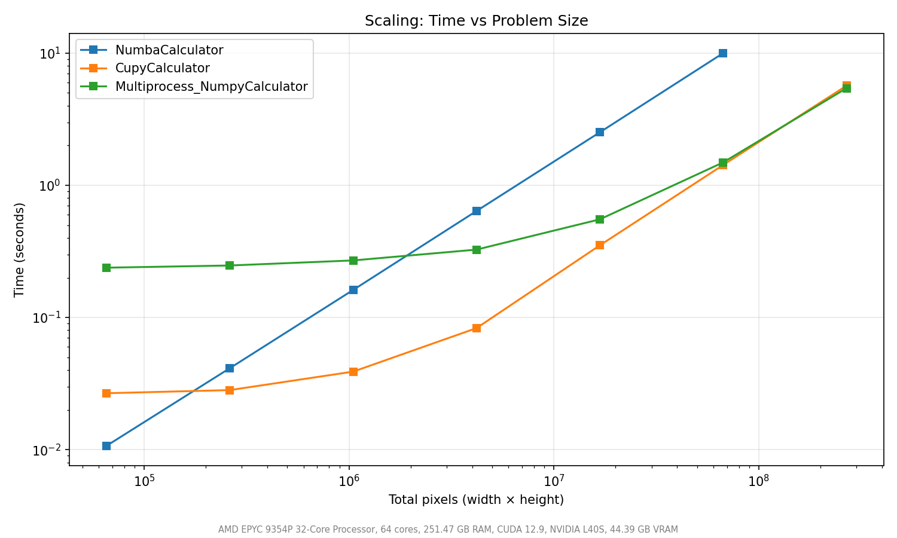

# Miniproject 3 — Mandelbrot Set Benchmark

## Project Structure

```
miniproject3/
├── src/                      # Calculator implementations
│   ├── config.py             # MandelbrotConfig dataclass
│   ├── mb_calculator.py      # Abstract base class (MandelbrotCalculator)
│   ├── mb_native_calculator.py   # Pure Python nested-loop
│   ├── mb_numpy_calculator.py    # Vectorized NumPy
│   ├── mb_numba_calculator.py    # Numba JIT-compiled
│   ├── mb_dask_calculator.py     # Dask array map_blocks
│   ├── mb_multiprocess_calculator.py  # Multiprocessing (configurable base)
│   └── mb_cupy_calculator.py     # GPU-accelerated via CuPy (CUDA)
├── benchmark_app/            # Benchmark application
│   ├── main.py               # Entry point
│   ├── benchmark_config.py   # BenchmarkConfig dataclass + calculator registry
│   ├── benchmark_runner.py   # BenchmarkRunner — times calculators, saves CSV
│   ├── device_scanner.py     # Hardware detection (CPU, GPU, CUDA)
│   └── plot_maker.py         # PlotMaker — generates plots from results
├── test/                     # Tests (pytest)
│   ├── calculator_test.py    # Generic contract tests for all calculators
│   ├── test_helpers.py       # Unit tests for internal functions
│   ├── test_benchmark_runner.py  # BenchmarkRunner tests
│   └── test_device_scanner.py    # Device scanner tests
├── results/                  # Benchmark output (plots + CSV)
└── README.md
```

## Implementations

Each calculator inherits from `MandelbrotCalculator` and implements `calculate() -> np.ndarray`.

| Calculator | Description |
|---|---|
| `NativeCalculator` | Pure Python double loop. Slowest but simplest baseline. |
| `NumpyCalculator` | Vectorized with NumPy masks. No extra dependencies. |
| `NumbaCalculator` | JIT-compiled with `@jit(nopython=True)`. Near-C speed after warmup. |
| `DaskCalculator` | Dask array `map_blocks` — splits the complex plane into chunks and computes each via Dask's scheduler. Uses the same NumPy kernel per chunk. |
| `MultiprocessCalculator` | Splits image into chunks, processes in parallel with `multiprocessing.Pool`. Configurable base calculator (`native`, `numpy`, `numba`). |
| `CupyCalculator` | GPU-accelerated using CuPy — same vectorized algorithm as NumPy but executes on the CUDA device. |

### Docstrings

All major functions include NumPy-style docstrings describing purpose, parameters, and return values.
Key examples:
- `_generate_chunks(cfg)` — splits full image into tiles based on `chunk_size`
- `_process_chunk(args)` — computes a single chunk using the selected base calculator
- `_mandelbrot_chunk(c_chunk, max_iter)` — NumPy kernel used by Dask `map_blocks`
- `CupyCalculator.calculate()` — vectorized GPU computation via CuPy arrays
- `_numba_compute(...)` — JIT-compiled kernel for the Numba path

## CUDA / GPU Implementation

The GPU implementation uses **CuPy** (`cupy-cuda12x`), which provides a NumPy-compatible API that executes on the GPU via CUDA.

### Block Size / Warp-Size Analysis

CuPy manages kernel launch parameters internally. The vectorized approach processes the entire grid as a GPU array operation — CuPy automatically selects block dimensions that are multiples of the warp size (32 threads). This is optimal because:
- Threads within a warp execute in lockstep (SIMT); non-warp-multiple block sizes waste execution slots
- CuPy's default heuristics (typically 128 or 256 threads/block) satisfy the warp-size-multiple rule without manual tuning
- For the iterative Mandelbrot workload, thread divergence (pixels escaping at different iterations) is the primary bottleneck, not block size selection

### Why CuPy over `@cuda.jit`

CuPy was chosen over Numba's `@cuda.jit` because:
1. Drop-in replacement for NumPy — minimal code changes
2. Automatic memory management and kernel configuration
3. Better suited for array-level parallelism (the Mandelbrot iteration loop is naturally expressed as masked array ops)

## Performance Analysis

### Benchmark Configuration

```python
calculators = ["numba", "cupy", "dask",
               "multiprocess_numpy", "multiprocess_numba"]
resolutions = [256, 512, 1024, 2048, 4096, 8192, 16384]
max_iter = 100, chunk_size = 128
num_runs = 3, warmup_runs = 1
num_processes = 64
```

### Results

#### Execution Times (seconds, mean ± std)

| Resolution | Numba | CuPy (GPU) | Dask | MP+NumPy (64p) | MP+Numba (64p) |
|---|---|---|---|---|---|
| 256×256 | 0.011 ± 0.000 | 0.026 ± 0.000 | 0.032 ± 0.001 | 1.144 ± 0.021 | 2.753 ± 0.495 |
| 512×512 | 0.042 ± 0.001 | 0.027 ± 0.000 | 0.081 ± 0.002 | 1.147 ± 0.004 | 1.947 ± 0.010 |
| 1024×1024 | 0.162 ± 0.002 | 0.036 ± 0.001 | 0.248 ± 0.002 | 1.191 ± 0.022 | 1.514 ± 0.390 |
| 2048×2048 | 0.641 ± 0.000 | 0.077 ± 0.001 | 0.798 ± 0.017 | 1.238 ± 0.008 | 1.270 ± 0.028 |
| 4096×4096 | 2.538 ± 0.008 | 0.336 ± 0.000 | 2.863 ± 0.015 | 1.506 ± 0.047 | 1.489 ± 0.049 |
| 8192×8192 | 10.009 ± 0.016 | 1.403 ± 0.000 | 10.622 ± 0.022 | 2.393 ± 0.059 | 2.247 ± 0.062 |
| 16384×16384 | 39.553 ± 0.019 | 5.540 ± 0.002 | 40.488 ± 0.063 | 5.654 ± 0.317 | 5.468 ± 0.468 |

#### Speedup vs Numba at 16384×16384

| Calculator | Time (s) | Speedup |
|---|---|---|
| Numba (baseline) | 39.55 | 1.0× |
| CuPy (GPU) | 5.54 | **7.1×** |
| Dask | 40.49 | 1.0× |
| MP+NumPy (64 procs) | 5.65 | **7.0×** |
| MP+Numba (64 procs) | 5.47 | **7.2×** |

#### Plots

The benchmark generates three plots saved to `results/`:

- **Time vs Resolution** (`results/time_vs_resolution.png`) — log-scale line plot showing how each implementation scales with image size
- **Speedup** (`results/speedup.png`) — bar chart of speedup relative to the baseline at each resolution
- **Scaling** (`results/scaling.png`) — log-log plot of execution time vs total pixel count




### Speedup Summary

Key observations from the benchmark:

- **CuPy (GPU)** is the fastest at all resolutions ≥ 512×512. At 16384×16384, it achieves a **7.1× speedup** over single-threaded Numba. Even at 512×512 (just 262K pixels), CuPy (0.027s) already outperforms Numba (0.042s).
- **Numba** is the fastest single-threaded CPU implementation, ~4× faster than NumPy-based approaches (Dask, NumpyCalculator) thanks to JIT compilation eliminating Python overhead.
- **Dask** performs nearly identically to single-threaded NumPy (40.49s vs ~39.55s at 16384). Using the default synchronous scheduler, Dask adds chunking overhead without parallelism. Dask's advantage would require the distributed scheduler or threaded scheduler with GIL-releasing code.
- **Multiprocess+NumPy** (64 processes) has ~1.1s constant overhead from process pool creation, but scales well at large sizes — reaching 5.65s at 16384×16384 (7.0× speedup).
- **Multiprocess+Numba** (64 processes) has higher startup overhead (~2.7s at 256×256 due to per-process JIT compilation), but at large sizes converges with MP+NumPy and slightly outperforms it (5.47s, 7.2× speedup).

### Scaling Analysis

The benchmark ramps resolution from 256×256 (65K pixels) to 16384×16384 (~268M pixels ≈ 10^8.4):

- **Small sizes (≤512×512):** Numba and CuPy are fast (<0.05s). Multiprocessing overhead dominates — MP variants take >1s regardless of resolution. Dask adds marginal overhead over raw NumPy.
- **Medium sizes (1024–2048):** CuPy pulls ahead decisively (0.036s at 1024 vs 0.162s for Numba). Multiprocessing starts becoming competitive as work-per-chunk grows.
- **Large sizes (4096+):** CuPy clearly dominates. MP+Numba and MP+NumPy converge to similar times (~5.5s at 16384) as the 64-process pool fully saturates. Dask and single-threaded Numba both hit ~40s — Dask's synchronous scheduler provides no parallelism benefit.

### Performance Differences Explained

1. **CuPy vs CPU:** The GPU has thousands of CUDA cores executing pixel computations in parallel. At 16384×16384 (268M pixels), the massive parallelism of the GPU vastly outweighs host↔device memory transfer overhead.

2. **Numba vs Dask:** Numba JIT-compiles to native machine code, eliminating Python interpreter overhead. Dask with the synchronous scheduler still runs NumPy kernels sequentially — each `map_blocks` chunk runs one at a time. The ~2% overhead Dask adds comes from chunking/reassembly.

3. **Multiprocessing overhead:** Spawning 64 processes and serializing/deserializing chunks via IPC costs ~1.1s (NumPy base) or ~2.7s (Numba base, due to per-process JIT warmup). This fixed cost means multiprocessing only pays off at large resolutions.

4. **MP+Numba vs MP+NumPy convergence:** At 16384×16384 both achieve ~5.5s. With 16384 chunks across 64 processes, each process handles ~256 chunks of 128×128 pixels. The per-chunk compute time is small enough that the base calculator choice (NumPy vs Numba for 128×128) becomes less significant than IPC and scheduling overhead.

### Why GPU Wins at Scale

1. **Pixel-level parallelism** — each pixel is independent; GPUs excel at this pattern
2. **Memory bandwidth** — GPU HBM/GDDR bandwidth far exceeds CPU DRAM for bulk array ops
3. **Overhead amortization** — host↔device transfer cost becomes negligible relative to computation at large N

### Why Multiprocessing Has Limits

- ~1–3s fixed overhead from process pool creation and per-process initialization
- Memory duplication across workers (each chunk is serialized and copied via IPC)
- Cannot use GPU (CUDA contexts are per-process and don't survive `fork()`)

### Why Dask Underperforms

- Default synchronous scheduler runs chunks sequentially — no actual parallelism
- Adds overhead from Dask graph construction, chunking, and task scheduling
- Would benefit from `dask.distributed` or threaded scheduler, but the NumPy GIL limits thread-based parallelism

## Unit Testing

Tests use **pytest** with parametrized fixtures. Run with:

```bash
cd miniproject3
pytest test/ -v
```

### Test Cases (71 total)

**`calculator_test.py`** — contract tests applied to ALL implementations:
1. `test_output_shape` — result has correct (height, width) dimensions
2. `test_output_dtype_is_integer` — iteration counts are integers
3. `test_iteration_bounds` — values in [1, max_iter]
4. `test_center_point_stays_in_set` — origin (0+0j) reaches max_iter
5. `test_corner_escapes_quickly` — point with |c|>2 escapes fast
6. `test_deterministic` — two runs produce identical results
7. `test_all_implementations_agree` — all calculators give same output
8. `test_1x1_grid_no_crash` — edge case: single-pixel grid

**`test_helpers.py`** — unit tests for internal functions:
- `_generate_chunks`: chunk count, coverage, bounds correctness
- `_process_chunk`: shape, dtype, offset preservation
- `_numba_compute`: shape, known-point behavior, cross-check vs native

**`test_benchmark_runner.py`** — tests for the benchmark infrastructure:
- `BenchmarkResult`: mean, std, min calculations
- `BenchmarkRunner`: correct result count, calculator names, resolutions, timing, multi-calculator runs, early stopping on slow calculators

**`test_device_scanner.py`** — tests for hardware detection:
- `scan_devices`: returns dict with all required keys, correct types
- `format_device_info`: comma-delimited output, handles bytes GPU names, CUDA/no-CUDA paths
- Internal helpers: `_get_cpu_info`, `_get_memory_gb`, `_get_physical_cores`

## Requirements

```
numpy
numba
matplotlib
pytest
cupy-cuda12x
dask
```

Install:
```bash
pip install numpy numba matplotlib pytest cupy-cuda12x dask
```

## Running the Benchmark

```bash
cd miniproject3
python benchmark_app/main.py
```

Results (plots and CSV) are saved to `results/`.

The benchmark outputs:
- `results/timing_results.csv` — raw timing data (calculator, resolution, mean, std, min, individual runs)
- `results/time_vs_resolution.png` — log-scale line plot
- `results/speedup.png` — bar chart of speedup vs baseline
- `results/scaling.png` — log-log scaling plot

### Customising the Benchmark

Edit `benchmark_app/main.py` or create your own script:

```python
from benchmark_app import BenchmarkConfig, BenchmarkRunner, PlotMaker
from src.config import MandelbrotConfig

config = BenchmarkConfig(
    mb_config=MandelbrotConfig(max_iter=200, chunk_size=64),
    calculators=["numpy", "numba", "cupy", "dask", "multiprocess_numba"],
    resolutions=[256, 512, 1024, 2048, 4096],
    num_runs=5,
    warmup_runs=2,
)

runner = BenchmarkRunner(config)
results = runner.run()
runner.save_csv(output_dir="results")

PlotMaker(results).make_all_plots(show=True)
```

## Running Tests

```bash
cd miniproject3
pytest test/ -v
```
