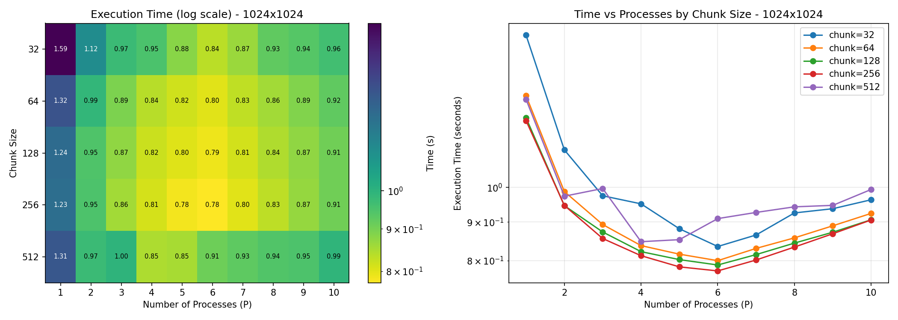
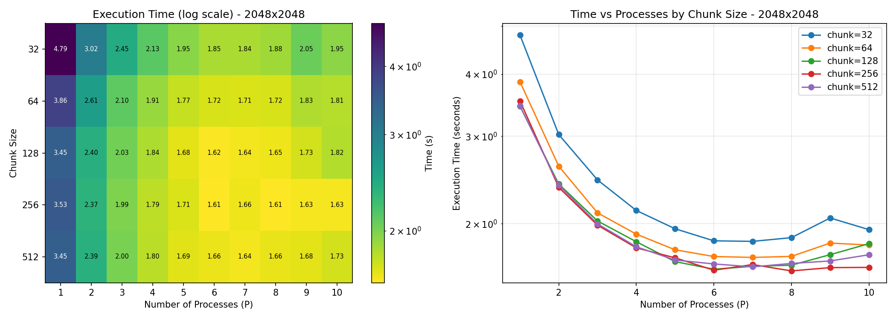
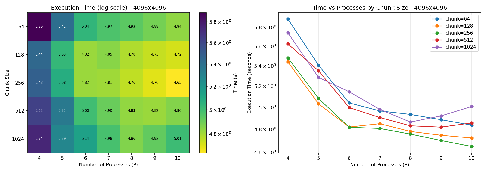
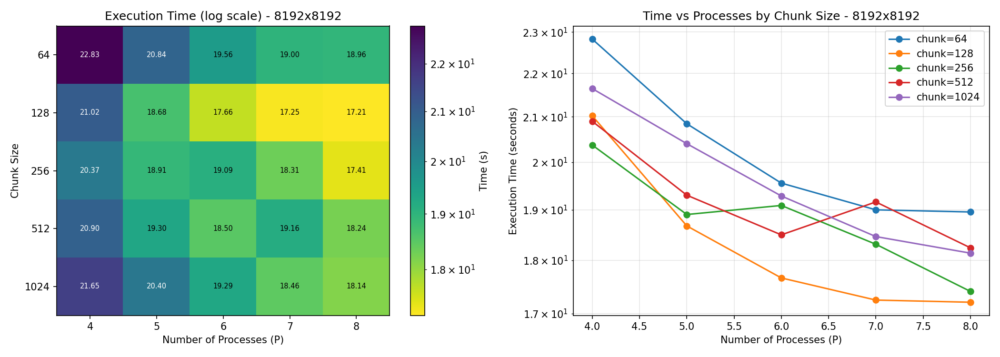
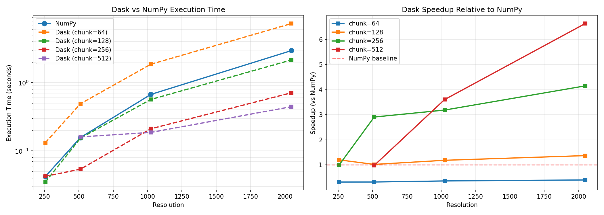
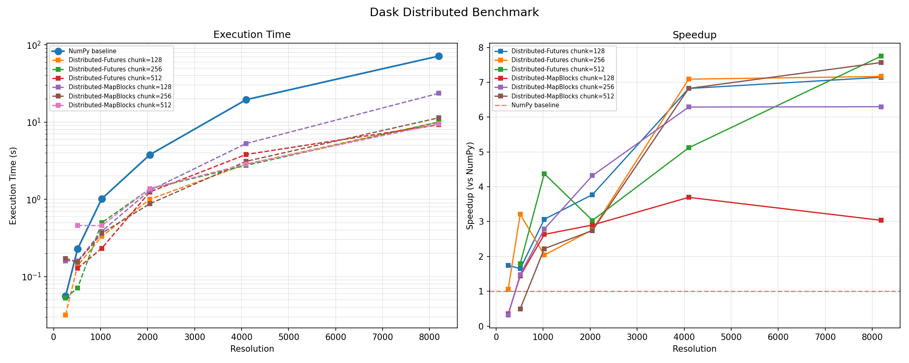

# Miniproject 2 Report

## 1. Introduction
- Overview of implementations covered: NumPy baseline( imported from MiniProject 1), Multiprocessing, Dask (single-node), Dask Distributed (cluster)

```
miniproject_2/
│
├── config.py                          # Shared constants (bounds, resolutions, paths)
│
├── miniproject_1.py                   # Core Mandelbrot implementations (reused by all)
│   ├── visualize()                    # Plots a Mandelbrot array with matplotlib
│   ├── export_to_csv()                # Saves results or timing data to CSV
│   └── numpy_implementation()         # Vectorised NumPy — main reference implementation
│
├── mp_implementation.py               # Multiprocessing implementation
│   ├── export_to_csv()                # Local CSV helper
│   ├── generate_chunks()              # Splits the grid into sub-regions with coordinate bounds
│   ├── process_chunk()                # Worker function — runs numpy_implementation on one chunk
│   └── compute_mandelbrot_parallel()  # Orchestrates mp.Pool over all chunks
│
├── benchmark_chunk_size.py            # Chunk size optimisation experiment
│   ├── benchmark_chunk_process_combinations()  # Sweeps chunk sizes × process counts
│   ├── save_results()                 # Saves benchmark tuples to CSV
│   └── plot_results()                 # Plots execution time heatmap per resolution
│
├── dask_implementation.py             # Dask single-node implementation
│   ├── _mandelbrot_chunk()            # Pure-NumPy kernel — applied per chunk via map_blocks
│   ├── dask_implementation()          # Builds Dask array, maps kernel, calls .compute()
│   ├── benchmark_dask_vs_numpy()      # Benchmarks Dask vs NumPy across resolutions/chunk sizes
│   ├── plot_comparison()              # Plots execution time and speedup comparison
│   └── save_results()                 # Saves benchmark results to CSV
│
├── dask_distributed_implementation.py # Dask Distributed cluster implementation
│   ├── _mandelbrot_chunk()            # NumPy kernel (defined locally to avoid import on workers)
│   ├── _compute_subregion()           # Builds and computes a subregion from scalar bounds only
│   ├── distributed_map_blocks()       # Builds Dask array from delayed blocks → client.compute()
│   ├── distributed_futures()          # Submits row slices as explicit Futures → client.submit()
│   ├── benchmark_distributed()        # Benchmarks both strategies vs NumPy on the cluster
│   ├── plot_results()                 # Plots execution time and speedup for cluster results
│   └── save_results()                 # Saves benchmark results to CSV
│
└── results/                           # All benchmark outputs
    ├── chunk_benchmark_*.csv/png      # Chunk size × process sweep per resolution
    ├── dask_vs_numpy_benchmark.csv    # Dask single-node vs NumPy timings
    ├── dask_vs_numpy_comparison.png   # Visualisation of Dask single-node vs NumPy
    ├── distributed_benchmark.csv      # Cluster benchmark results
    ├── distributed_benchmark.png      # Visualisation of cluster results
    ├── multi_process_mb_set_*.csv     # Mandelbrot output arrays (MP runs)
    └── timing_results.csv             # General timing log for the basic mp implementation
```
---

## 2. Implementation Overview
- **NumPy baseline** — imported from the miniproject_1
- **Multiprocessing** — chunk-based workload split across P processes using `mp.Pool`
- **Dask (single-node)** — `da.map_blocks` distributing chunks across local threads/processes
- **Dask Distributed (cluster)** — `da.from_delayed` + `client.submit` across 4 worker VMs

---

## 3. Multiprocessing Results





### 3.1 Optimal Chunk Size Analysis

- As seen in the heatmaps the optimal chunk is depended on the resolution. But in most of the cases is tas around 128-256 only getting some better results at biggest resolution to the 512

### 3.2 Speedup vs Number of Processes

- To many processes for to small calculation was suboptimal. also occupying all avaliable cores slowwed down due to OS interference.

---

## 4. Dask Single-Node Results

### 4.1 Execution Time vs NumPy


| Resolution | Implementation | Chunk Size | Avg Time (s) | Speedup vs NumPy |
|:----------:|:--------------:|:----------:|:------------:|:----------------:|
| 2048       | NumPy          | —          | 2.9506       | 1.00×            |
| 2048       | Dask           | 64         | 7.3488       | 0.40×            |
| 2048       | Dask           | 128        | 2.1510       | 1.37×            |
| 2048       | Dask           | 256        | 0.7105       | 4.15×            |
| 2048       | Dask           | 512        | 0.4445       | 6.64×            |

### 4.2 Effect of Chunk Size
- **Chunk 64**: always slower than NumPy — scheduler overhead from hundreds of tiny tasks dominates computation time
- **Chunk 128**: near-parity with NumPy; overhead and parallelism roughly balance
- **Chunk 256–512**: significant speedups; fewer, denser tasks reduce scheduling cost and improve cache utilisation
- Low resolutions (256) saturate at chunk 128 — larger chunks leave cores idle; high resolutions (1024+) benefit most from chunk 512
- Avg speedup by chunk size: 64 → 0.35×, 128 → 1.20×, 256 → 2.81×, 512 → 3.74×

---

## 5. Dask Distributed (Cluster) Results

### 5.1 Cluster Setup
- Head node (scheduler) + 4 worker VMs
- Python/NumPy version alignment challenges encountered

### 5.2 Distributed-MapBlocks vs Distributed-Futures


| Resolution | NumPy (s) | Strategy            | Chunk | Avg Time (s) | Speedup |
|:----------:|:---------:|:-------------------:|:-----:|:------------:|:-------:|
| 256        | 0.056     | Distributed-Futures | 128   | 0.032        | 1.75×   |
| 256        | 0.056     | Distributed-MapBlocks | 128 | 0.160        | 0.35×   |
| 512        | 0.228     | Distributed-Futures | 256   | 0.071        | 3.21×   |
| 512        | 0.228     | Distributed-MapBlocks | 256 | 0.154        | 1.48×   |
| 1024       | 1.013     | Distributed-Futures | 512   | 0.232        | 4.37×   |
| 1024       | 1.013     | Distributed-MapBlocks | 256 | 0.364        | 2.79×   |
| 2048       | 3.777     | Distributed-MapBlocks | 256 | 0.874        | 4.32×   |
| 2048       | 3.777     | Distributed-Futures | 128   | 1.000        | 3.77×   |
| 4096       | 19.497    | Distributed-Futures | 256   | 2.750        | 7.09×   |
| 4096       | 19.497    | Distributed-MapBlocks | 512 | 2.858        | 6.82×   |
| 8192       | 71.499    | Distributed-Futures | 512   | 9.224        | 7.75×   |
| 8192       | 71.499    | Distributed-MapBlocks | 512 | 9.450        | 7.57×   |

- **MapBlocks**: builds the full Dask task graph upfront before dispatching — predictable scheduling but higher graph-construction overhead at small grids
- **Futures**: submits row slices directly via `client.submit()` — workers start immediately, lower latency; outperforms MapBlocks at small-to-medium resolutions
- At large resolutions (4096+) both strategies converge as compute dominates communication

### 5.3 Cluster vs Single-Node Dask
- At resolutions ≤ 512 the cluster offers no benefit — network serialisation overhead exceeds the gain from extra workers
- From 1024 onward the cluster consistently outperforms single-node Dask; at 4096 the best cluster time (2.75 s) beats the best single-node time by roughly 2×
- Peak speedup: cluster Futures at 8192 achieves **7.75×** over NumPy vs single-node Dask (not benchmarked at 8192 due to memory pressure)
- Adding 4 workers scales sub-linearly — network round-trips and scheduler overhead consume ~1 worker equivalent of capacity

---

## 6. Reflections
- **Chunk size** is the dominant tuning parameter across all implementations; choosing it poorly (too small) negates all parallelism gains
- **Multiprocessing** is the simplest to reason about but hits a ceiling at 4–8 processes due to OS scheduling interference and IPC overhead
- **Dask single-node** outperforms multiprocessing for large grids with the right chunk size, benefiting from a smarter scheduler and shared memory
- **Dask Distributed** only wins at resolutions ≥ 1024; below that, network latency makes it slower than running locally
- The **Futures strategy** is generally preferable for embarrassingly parallel workloads — it avoids full graph construction and lets workers start immediately
- The most significant practical obstacle was **Python/NumPy version alignment** across cluster nodes; a mismatched serialisation format caused silent failures before being resolved
- Overall, parallelism is most valuable where the working set is large enough that task overhead is negligible relative to compute time